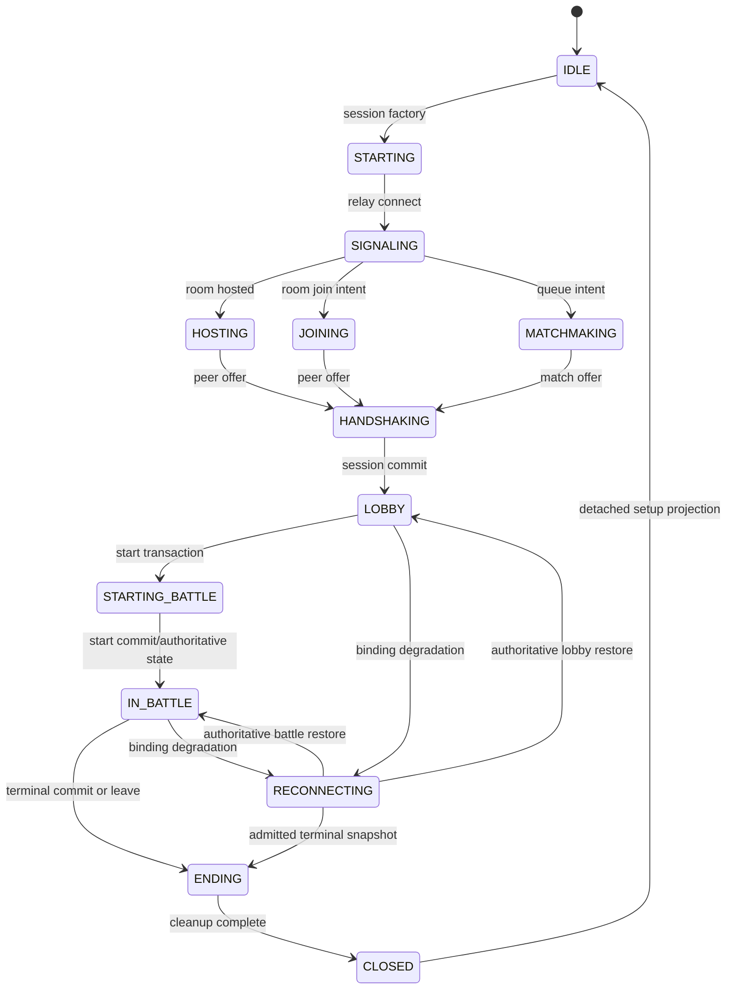

# Current phase transition call graph

`OnlineRuntime.StateMachine` is the only runtime lifecycle writer.

Failure edges from active states enter `FAILED`, then cleanup enters `CLOSED`/`IDLE`. `ProjectionTransaction` maps stable runtime state to ENTRY, LOBBY, IN_BATTLE, TERMINAL, or SETUP. `SessionScope.transitionPhase` first cancels prior-phase resources and advances the projection epoch. Visibility changes only ask transport/restore owners to converge; they do not directly transition battle state or render buttons.

Result-to-setup order: canonical winner commit -> host terminal publication -> runtime `ENDING`/TERMINAL projection -> `CleanupCoordinator.close` -> scope close and battle/application releases -> detached SETUP projection -> IDLE.
