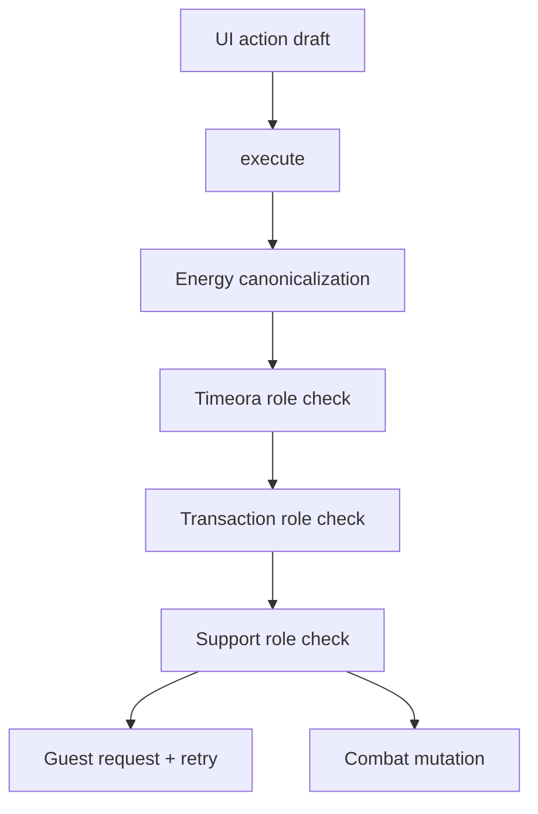

# Online action call graphs

## Baseline conflict

The guest may reach `EN` before `REQ`; three layers can classify the same network fact.

## Canonical local host action

`UI draft -> OnlineActionAdmissionOwner.submit -> validate session/match/turn/actor -> executeCanonicalActionTransaction -> combat mutation -> turnSerial advance -> transaction commit -> revision advance/publication -> ProjectionTransaction`

## Canonical local guest action

`UI draft -> OnlineActionAdmissionOwner.submit -> validate local eligibility -> freeze command envelope -> store one pending command -> session-scoped send/retry -> pending immutable view -> action-panel projection`

No game mutation occurs on this path.

## Remote guest-to-host command

`transport route -> OnlineActionAdmissionOwner.receive -> validate protocol/match/role/expected turn/team/slot/action ID -> duplicate-result lookup -> executeCanonicalActionTransaction -> exactly-once commit -> cache resolution -> authoritative publication`

## Host authoritative application on guest

`authoritative envelope -> match/mode/revision admission -> pending resolution -> immutable snapshot revive -> admitted revision -> one ProjectionTransaction -> input availability derivation`

For a terminal snapshot the tail is instead: `admitted winner/revision -> OnlineRuntime.markBattleEnded -> cancel restore/IN_BATTLE resources -> ENDING -> one TERMINAL ProjectionTransaction -> result presentation`. Projection never creates the winner or changes lifecycle state.

## Host terminal commit

`canonical action commit -> winner/turnSerial committed -> authoritative revision and terminal snapshot retained/sent -> OnlineRuntime.markBattleEnded -> ENDING -> one TERMINAL ProjectionTransaction`

## Reconnect with pending command

`binding restore -> stateRequest carrying pending action ID -> host cached resolution/current authoritative snapshot -> envelope admission -> pending settles as accepted/rejected/superseded -> retry resource cancelled -> projection`

Retries never execute the combat action and never infer success from UI. Duplicate commands return the cached authoritative resolution/snapshot.
